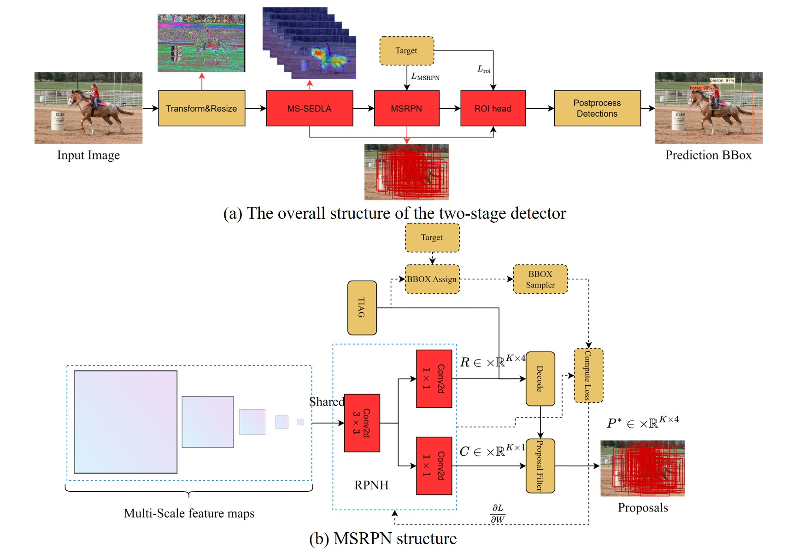

# MS-SEDLA-for-crash-Pytorch-implementationch

**Noval application:** The study of Crashworthiness based on computer vision  

- [FrameWork](#FrameWork)
- [Training](#Training)
- [Testing](#Testing)
- [Acknowledgments](#Acknowledgments)
- [License](#license)

## FrameWork

We develop a new robust detector based on the two-stage detector, which includes the Squeeze-and-Excitation Deep Layer Aggregation network (SEDLA) as backbone and the rethinking mechanism of the scale fusion neck. Our overall model is as follows:

