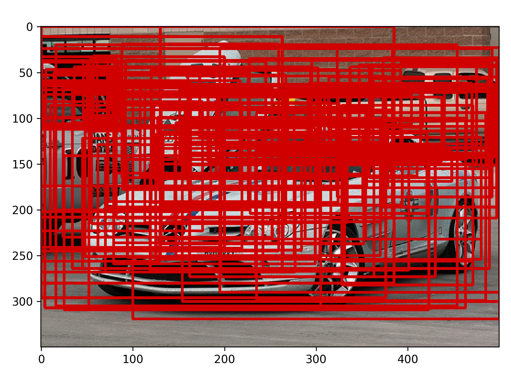

# MS-SEDLA-for-crash-Pytorch-implementationch

**Noval application:** The study of Crashworthiness based on computer vision  

- [FrameWork](#FrameWork)
- [Training](#Training)
- [Validation](#Validation)
- [Results](#Results)
- [Acknowledgments](#Acknowledgments)
- [License](#license)

## FrameWork

We develop a new robust detector based on the two-stage detector, which includes the Squeeze-and-Excitation Deep Layer Aggregation network (SEDLA) as backbone and the rethinking mechanism of the scale fusion neck. Our overall model is as follows:

## Training
**Train directly**    
We conducted experiments on the VOC small data set, and the mAP@0.5 was `81.6` and achieved good results in the top 10 of the [Tensorboard](https://paperswithcode.com/sota/object-detection-on-pascal-voc-2007). If you want to run the training model directly, you can run [train_engine](train_engine.py) directly. The premise is that your data should be placed in the [data] (data) directory like VOC type, and the pre-trained weights of the DLA backbone can be obtained in [Google Cloud Disk](https://drive.google.com/file/d/1gS1SVWw4hHdcpxTilRpwHZcYvxsZh2dH/view?usp=drive_link) or [url](http://dl.yf.io/dla/models) and put it into the [pretrain](backbone/pretrain) root.   
You can switch between two training modes: `VOC07trainval-VOC07test(VOC07)` and `VOC07trainval+VOC12trainval12(VOC07+12)`. Just modify `line 91` and `line 125` in [train_engine](train_engine.py).

**Continue training**  
If you want to continue training, you can download the trained weight file from [Google Cloud Disk ](https://drive.google.com/file/d/1Fv84ZJSLZBog-cc1LWtIiC1ylSfW-zJU/view?usp=drive_link). Next, put it into [save_weights](save_weights) and modify `resume` in [train_engine](train_engine.py) to point to the weights file.  

**Train your own data**
You first need to create the data set in VOC format. Of course, you can also do it according to any data format of [COCO](https://cocodataset.org/#home), but just rewrite a [datasets.py](my_dataset/datasets.py), about COCO dataset For reading, you can refer to [pycocotools](https://pypi.org/project/pycocotools/). Next, you need to make a classification similar to (pascal_voc_classes.json)[data/pascal_voc_classes.json]. The file is read as a dictionary. Finally, you only need to modify the `num_classes` and `class_path` parameters to train your dataset.  

## Validation  
Similar to training, you only need to modify `num_classes` and `label_json_path` for evaluation, and it will generate an evaluation txt file [record_mAP.txt](record_mAP.txt).

## Results  
通过运行[predict.py](predict.py)来生成`demo`文件夹下的可解释性的热力图，提议覆盖图，数据增强图像以及检测结果。结果存放在`exe`目录下。
**无梯度Grad-cam：**  

**Transforms:**   

**Proposals:** 

**Detections:**

